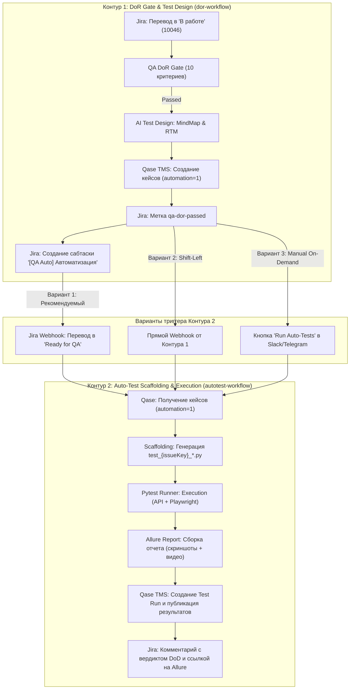

# QA Autotest Pipeline (n8n Workflow 2)

Второй контур оркестрации автоматизации тестирования: генерация автотестов, запуск в CI/CD и синхронизация результатов с Qase TMS и Jira.

---

## 🏗️ Двухзвенная архитектура n8n (Порядок и разделение ответственности)

Вместо одного гигантского монолитного воркфлоу на 50 нод, пайплайн разделен на два специализированных независимых контура:



---

## 🎯 Сравнение вариантов триггеров для старта автокейсов

| Триггер | Описание | Плюсы | Минусы | Вердикт |
| :--- | :--- | :--- | :--- | :--- |
| **1. Jira Webhook: `Ready for QA` / `In QA`** *(Рекомендуемый)* | Срабатывает, когда разработчик закончил код и задача передана в тестирование | • Код функционала уже на стенде<br>• Тесты сразу выполняются вживую<br>• Естественный жизненный цикл задачи | Требует соблюдения процесса перехода статусов в Jira | **⭐ Лучший выбор для Production** |
| **2. Прямая цепочка (Chaining от DoR)** | n8n сразу после создания тест-кейсов в Qase триггерит генерацию автотестов | • Мгновенная готовность (Zero-touch)<br>• Парадигма TDD / ATDD (тесты готовы до кода) | Если требования изменятся при разработке, тесты придется править | **Отлично для TDD** |
| **3. Webhook по сабтаске `QA Automation`** | n8n слушает перевод сабтаски автоматизации в статус `В работе` | • Изолированный учет трудозатрат QA<br>• Полный контроль инженера | Дополнительное действие по переводу сабтаски | **Хорошо для крупных команд** |

---

## 📦 Спецификация контракта данных для генератора автотестов

При срабатывании триггера в Контур 2 передается контекст:

```json
{
  "issueKey": "JS-16",
  "issueSummary": "Личный кабинет пользователя и безопасность аккаунта",
  "qaseProject": "JS",
  "testSuite": {
    "backend": [
      { "id": 81, "title": "Регистрация пользователя", "schema": "UserRegistrationResponse" },
      { "id": 84, "title": "Логин и выдача JWT", "schema": "LoginResponse" }
    ],
    "frontend": [
      { "id": 57, "title": "Форма регистрации", "page": "RegisterPage" },
      { "id": 61, "title": "Авторизация в UI", "page": "LoginPage" }
    ]
  }
}
```
