# QA DoR Gate & Автотесты (Сквозная оркестрация в n8n)

Автоматизированный сквозной пайплайн тестирования в n8n для проекта OWASP Juice Shop: от проверки требований задачи (DoR) в Jira до автоматического создания чек-листов, сценариев в базе тестов Qase, промежуточных этапов контроля качества, генерации кода автотестов на Python и добавления их в рабочий проект.

## Архитектура сквозного пайплайна (38 нод + 9 стикеров с описанием)

```mermaid
flowchart TD
  subgraph Ingestion ["1. Приём задач из Jira"]
    A["Jira: Перехват обновления задачи"] --> D["Фильтр: Задача взята в работу"]
    B["Расписание: Проверка задач (1 мин)"] --> C["Jira: Найти задачи В работе"]
    C --> D
    D --> E["Jira: Загрузить данные задачи & ссылки"]
  end

  subgraph DoR_Gate ["2. Проверка готовности задачи (DoR)"]
    E --> F["Правила проверки готовности задачи"]
    F --> G["Подготовка задачи к проверке"]
    G --> H["Проверка задачи на готовность"]
    H --> I{"Условие: Требования понятны?"}
  end

  subgraph Fail_Path ["3. Возврат задачи при неполных требованиях"]
    I -->|Нет| J["Jira: Отправить замечания к задаче"]
    J --> K["Jira: Вернуть задачу на доработку (transition 11)"]
    K --> L["Jira: Поставить метку Требует доработки"]
  end

  subgraph Pass_Path ["4. Создание проверок & Контроль 1"]
    I -->|Да| M["Jira: Отчет 1 — Задача готова к работе"]
    M --> N["Создание карты проверок (MindMap)"]
    N --> O["Jira: Отчет 2 — Карта проверок"]
    O --> P["Qase: Загрузить папки и существующие тесты"]
    P --> Q["Создание тест-кейсов без повторов"]
    Q --> R["Jira: Отчет 3 — Список тест-кейсов"]
    R --> S["Jira: Отчет 4 — Таблица покрытия требований"]
    S --> G1["Контроль 1: Подтверждение тест-кейсов"]
    G1 --> G1_C["Jira: Карточка подтверждения тестов"]
    G1_C --> G1_IF{"Условие: Тест-кейсы подтверждены?"}
    G1_IF -->|Да| T{"Условие: Есть новые тесты?"}
    T -->|Да| U["Qase: Создать новые тесты в базе"]
    T -->|Нет / Готово| V["Jira: Прикрепить ссылку на тесты в Qase"]
    U --> V
    V --> W["Jira: Поставить метку Готово к разработке"]
  end

  subgraph Autotests ["5. Автотесты, Контроль 2 & Завершение"]
    W --> SC["Создание файлов автотестов на Python"]
    SC --> G2["Контроль 2: Проверка качества кода тестов"]
    G2 --> G2_C["Jira: Карточка проверки кода тестов"]
    G2_C --> G2_IF{"Условие: Код тестов одобрен?"}
    G2_IF -->|Да| PR["Перенос автотестов в рабочий проект"]
    PR --> FIN["Jira: Отчет 5 — Автотесты готовы к запуску"]
  end
```



## Логические разделы и стикеры на холсте

1. **📥 1. Приём задач из Jira** (Синий стикер): автоматический перехват событий и резервный опрос Jira каждую минуту.
2. **📋 2. Проверка готовности задачи (DoR)** (Желтый стикер): проверка по 10 обязательным правилам качества требований.
3. **❌ 3. Возврат задачи при неполных требованиях** (Красный стикер): автоматический возврат задачи аналитику с комментариями, если требования неполные.
4. **🧠 4. Создание чек-листа и тест-кейсов** (Фиолетовый стикер): генерация карты проверок, тест-кейсов и таблицы покрытия требований со сверкой базы Qase.
5. **🛡️ 5. Контроль 1: Подтверждение тест-кейсов** (Бирюзовый стикер): промежуточная проверка придуманных тестов (авто-одобрение в тестовом проекте).
6. **📦 6. Сохранение тестов в систему Qase** (Зеленый стикер): сохранение новых тестов в Qase TMS, прикрепление ссылок в Jira и отметка готовности.
7. **⚙️ 7. Создание заготовок автотестов** (Синий стикер): генерация рабочего кода автотестов на Python (Playwright + API-клиент + схемы данных).
8. **🛡️ 8. Контроль 2: Проверка кода автотестов** (Бирюзовый стикер): автоматический контроль качества и надежности кода тестов.
9. **🚀 9. Перенос тестов в проект и завершение** (Зеленый стикер): добавление автотестов в проект, отправка финального отчета в Jira и закрытие задачи.

## Деплой в n8n
```bash
node qa-automation/n8n/dor-workflow/deploy.js
```
Ссылка на развернутый воркфлоу: [http://201.34.147.33:5678/workflow/Dv1WydaTMC1lxR0E](http://201.34.147.33:5678/workflow/Dv1WydaTMC1lxR0E)
